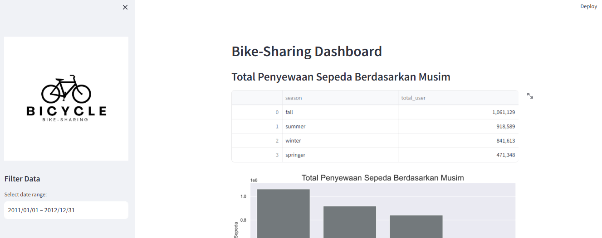

# bike-sharing-analysis
---



## Cara Menjalankan Proyek Ini

1. **Clone repository ini**
```bash
git clone https://github.com/itsraa17/bike-sharing-analysis.git

2. **Install semua library yang diperlukan**
```bash
pip install numpy pandas matplotlib seaborn jupyter streamlit babel

Atau jika ingin menggunakan file requirements.txt:
```bash
pip install -r requirements.txt

3. **Masuk ke folder dashboard**
```bash
cd dashboard

4.**Jalankan dashboard dengan Streamlit**
```bash
streamlit run dashboard.py
